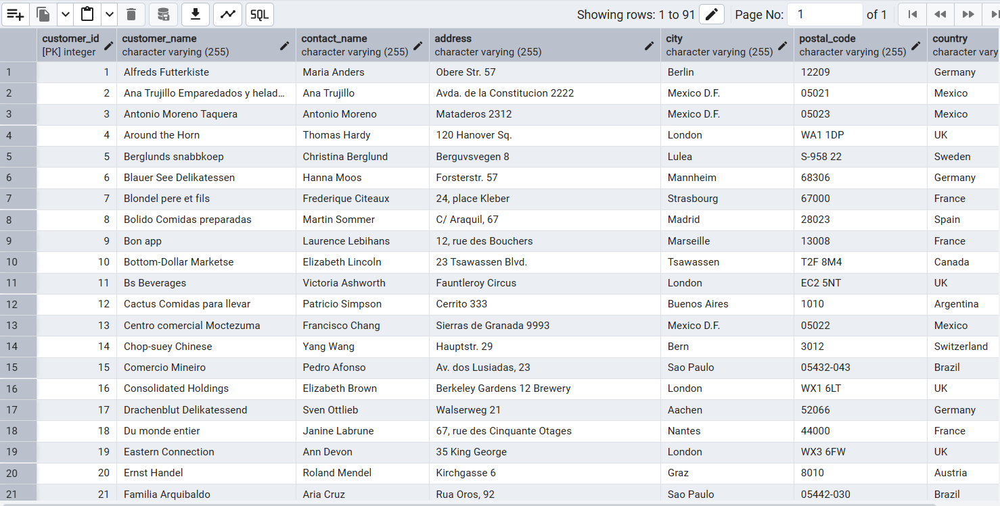

# PostgreSQL
## References
- [W3Schools](https://www.w3schools.com/postgresql/index.php)
## Tools needed
- [PostgreSQL](https://www.enterprisedb.com/postgresql-tutorial-resources-training-1?uuid=140fdf8e-34e6-4b1b-ac32-532e5ac826c4&campaignId=Product_Trial_PostgreSQL_14)
- [DBeaver](https://dbeaver.io/download/)
- [Installation](https://www.youtube.com/watch?v=h5LuXJ7ejQM)

## Tutorial
### Introduction
- **Definition**: PostgreSQL is an **open-source relational database management system** (RDBMS) that uses and extends SQL for querying and managing data.
- **Key Features**:
    - Stores data in **tables** (rows & columns).
    - Supports **SQL** (Structured Query Language).
    - Allows **advanced data types** (JSON, arrays, etc.).
    - Can handle **complex queries** and **large datasets**.
    - Supports **transactions** with ACID compliance (Atomicity, Consistency, Isolation, Durability).
- **Cross-platform**: Works on Windows, macOS, Linux.
- **Example**:
    
    ```sql
    SELECT version();
    ```
    
    Returns the installed PostgreSQL version.
    

### **psql Shell**

- **Definition**: A **command-line tool** for interacting with PostgreSQL databases.
- **Usage**:
    - Connect to a database.
    - Run SQL commands directly.
    - Manage users, databases, and permissions.
- **Start**:
    1. Open terminal / command prompt.
    2. Type `psql -U username -d dbname` (replace with your details).
- **Example**:
    
    ```sql
    \l       -- list all databases
    \c test  -- connect to 'test' database
    SELECT * FROM employees;
    ```
    

### **pgAdmin**

- **Definition**: A **graphical user interface (GUI)** for managing PostgreSQL.
- **Usage**:
    - Create, edit, and delete databases using menus.
    - Write and run SQL queries in a built-in editor.
    - View tables, schemas, and query results visually.
- **When to use**: Easier for beginners or for database visualization compared to typing commands in psql.

### **CREATE TABLE**

- **Definition**: SQL command used to **create a new table** in a PostgreSQL database.
- **Syntax**:
    
    ```sql
    CREATE TABLE table_name (
        column1 datatype constraints,
        column2 datatype constraints,
        ...
    );
    ```
    
- **Notes**:
    - **datatype**: Defines the type of data (e.g., `INTEGER`, `TEXT`, `DATE`).
    - **constraints**: Rules like `PRIMARY KEY`, `NOT NULL`, `UNIQUE`.
- **Example**:
    
    ```sql
    CREATE TABLE employees (
        id SERIAL PRIMARY KEY,
        name TEXT NOT NULL,
        salary NUMERIC(8,2),
        hire_date DATE
    );
    ```
    
- **Result**: Creates a table named **employees** with 4 columns.

### **INSERT INTO**

- **Definition**: SQL command to **add new rows** (records) into a table.
- **Syntax (Single Row)**:
    
    ```sql
    INSERT INTO table_name (column1, column2, ...)
    VALUES (value1, value2, ...);
    ```
    
    - You can omit the column list if inserting values for **all columns in order**.
- **Example (Single Row)**:
    
    ```sql
    INSERT INTO employees (name, salary, hire_date)
    VALUES ('John Doe', 50000.00, '2025-08-11');
    ```
    

---

### **INSERT INTO (Multiple Rows)**

- **Definition**: Insert **more than one row** in a single `INSERT` statement.
- **Syntax (Multiple Rows)**:
    
    ```sql
    INSERT INTO table_name (column1, column2, ...)
    VALUES
        (value1a, value2a, ...),
        (value1b, value2b, ...),
        (value1c, value2c, ...);
    ```
    
- **Example (Multiple Rows)**:
    
    ```sql
    INSERT INTO employees (name, salary, hire_date)
    VALUES
        ('Ali Hassan', 45000.00, '2025-08-11'),
        ('Sara Mohamed', 47000.00, '2025-08-11'),
        ('Omar Khaled', 52000.00, '2025-08-11');
    ```
    
- **Tip**: Use single quotes `' '` for text and dates, no quotes for numbers.

### **SELECT**

- **Definition**: SQL command used to **retrieve data** from a table.
- **Syntax**:
    
    ```sql
    SELECT column1, column2, ...
    FROM table_name;
    ```
    
    - Use  to select **all columns**.
- **Example 1** (specific columns):
    
    ```sql
    SELECT name, salary
    FROM employees;
    ```
    
- **Example 2** (all columns):
    
    ```sql
    SELECT *
    FROM employees;
    ```
    
- **Tip**: You can combine `SELECT` with other clauses like `WHERE`, `ORDER BY`, and `LIMIT` to filter and sort results.

### **ALTER TABLE**

- **Definition**: SQL command used to **change the structure** of an existing table.
- **Common Uses**:
    1. **Add a column**
        
        ```sql
        ALTER TABLE table_name
        ADD column_name datatype;
        ```
        
        Example:
        
        ```sql
        ALTER TABLE employees
        ADD department TEXT;
        ```
        
    2. **Drop (remove) a column**
        
        ```sql
        ALTER TABLE table_name
        DROP COLUMN column_name;
        
        ```
        
        Example:
        
        ```sql
        ALTER TABLE employees
        DROP COLUMN department;
        ```
        
    3. **Rename a column**
        
        ```sql
        ALTER TABLE table_name
        RENAME COLUMN old_name TO new_name;
        ```
        
        Example:
        
        ```sql
        ALTER TABLE employees
        RENAME COLUMN name TO full_name;
        ```
        
    4. **Change a column’s data type**
        
        ```sql
        ALTER TABLE table_name
        ALTER COLUMN column_name TYPE new_datatype;
        ```
        
        Example:
        
        ```sql
        ALTER TABLE employees
        ALTER COLUMN salary TYPE NUMERIC(10,2);
        ```
        

## **UPDATE**

- **Definition**: SQL command used to **modify existing rows** in a table.
- **Syntax**:
    
    ```sql
    UPDATE table_name
    SET column1 = value1, column2 = value2, ...
    WHERE condition;
    ```
    
    - The `WHERE` clause specifies **which rows** to update.
    - Without `WHERE`, **all rows** will be updated.
- **Example 1** (update specific row):
    
    ```sql
    UPDATE employees
    SET salary = 60000.00
    WHERE name = 'John Doe';
    ```
    
- **Example 2** (update multiple columns):
    
    ```sql
    UPDATE employees
    SET salary = 65000.00, department = 'IT'
    WHERE id = 3;
    ```
    
- **Example 3** (update all rows – be careful):
    
    ```sql
    UPDATE employees
    SET department = 'General';
    ```
    

### **DELETE**

- **Definition**: SQL command used to **remove rows** from a table.
- **Syntax**:
    
    ```sql
    DELETE FROM table_name
    WHERE condition;
    ```
    
    - The `WHERE` clause specifies **which rows** to delete.
    - Without `WHERE`, **all rows** will be deleted.
- **Example 1** (delete specific row):
    
    ```sql
    DELETE FROM employees
    WHERE id = 2;
    ```
    
- **Example 2** (delete based on condition):
    
    ```sql
    DELETE FROM employees
    WHERE salary < 40000.00;
    ```
    
- **Example 3** (delete all rows – be careful):
    
    ```sql
    DELETE FROM employees;
    ```
    

### **DROP TABLE**

- **Definition**: SQL command used to **delete an entire table** and all of its data permanently.
- **Syntax**:
    
    ```sql
    DROP TABLE table_name;
    
    ```
    
- **Example**:
    
    ```sql
    DROP TABLE employees;
    
    ```
    
- **Notes**:
    - Once dropped, the table **cannot be recovered** unless you have a backup.
    - You can use `IF EXISTS` to avoid an error if the table does not exist:
        
        ```sql
        DROP TABLE IF EXISTS employees;
        
        ```
        

### Example Database

you can find the database here 

[PostgreSQL - Create Demo Database](https://www.w3schools.com/postgresql/postgresql_create_demodatabase.php)

It contains the following tables:

1. customers



1. categories


1. Products


1. order_details


1. testproducts


### **Operators in the WHERE Clause**

Used to filter rows based on specific conditions in a `SELECT`, `UPDATE`, or `DELETE` statement.

| Operator | Meaning | Example |
| --- | --- | --- |
| `=` | Equal to | `WHERE salary = 50000` |
| `<` | Less than | `WHERE age < 30` |
| `>` | Greater than | `WHERE age > 40` |
| `<=` | Less than or equal to | `WHERE age <= 25` |
| `>=` | Greater than or equal to | `WHERE age >= 60` |
| `<>` | Not equal to | `WHERE city <> 'Cairo'` |
| `!=` | Not equal to | `WHERE city != 'Giza'` |
| `LIKE` | Match a pattern (case sensitive) | `WHERE name LIKE 'A%'` |
| `ILIKE` | Match a pattern (case insensitive) | `WHERE name ILIKE 'a%'` |
| `AND` | Logical AND | `WHERE age > 20 AND salary > 30000` |
| `OR` | Logical OR | `WHERE city = 'Cairo' OR city = 'Giza'` |
| `IN` | Value in a list | `WHERE department IN ('HR', 'IT')` |
| `BETWEEN` | Value in a range | `WHERE age BETWEEN 25 AND 35` |
| `IS NULL` | Value is NULL | `WHERE hire_date IS NULL` |
| `NOT` | Negates a condition | `WHERE name NOT LIKE 'A%'` |

### **SELECT DISTINCT**

- **Definition**: Returns only **unique values** from a column, removing duplicates.
- **Syntax**:
    
    ```sql
    SELECT DISTINCT column1, column2, ...
    FROM table_name;
    ```
    
- **Example**:
    
    ```sql
    SELECT DISTINCT country FROM customers; 
    ```
    
    → Lists each department only once.
    

---

### **COUNT(DISTINCT)**

- **Definition**: Counts the **number of unique (distinct) values** in a column.
- **Syntax**:
    
    ```sql
    SELECT COUNT(DISTINCT column_name)
    FROM table_name;
    ```
    
- **Example**:
    
    ```sql
    SELECT count(DISTINCT country) FROM customers; 
    ```
    
    → Returns how many different departments exist.
    

### **ORDER BY**

- **Definition**: Used to **sort the result set** of a query in ascending or descending order. It works with numbers and words
- **Syntax**:
    
    ```sql
    SELECT column1, column2, ...
    FROM table_name
    ORDER BY column_name [ASC|DESC];
    ```
    
    - `ASC` = Ascending (default).
    - `DESC` = Descending.
- **Example 1** (ascending):
    
    ```sql
    SELECT DISTINCT country 
    FROM customers
    ORDER BY country;
    ```
    


- **Example 2** (descending):
    
    ```sql
    SELECT DISTINCT country 
    FROM customers
    ORDER BY country DESC;
    ```
    


- **Example 3** (sort by multiple columns):
    
    ```sql
    SELECT DISTINCT country,customer_id 
    FROM customers
    ORDER BY country DESC,customer_id ASC;
    ```
    
- it will sort the output according to country descending, and then sort the columns with same country ascending according to the customer_id


### **OFFSET**

- **Definition**: Skips a specified number of rows before returning results (often used with `LIMIT`).
- **Syntax**:
    
    ```sql
    SELECT column1, column2, ...
    FROM table_name
    OFFSET number;
    ```
    
- **Example**:
    
    ```sql
    SELECT DISTINCT country 
    FROM customers
    ORDER BY country ASC
    OFFSET 2;
    ```
    
    → Skips the first 2 rows, returns the rest(Argentina and Austrilla disabered).
    


- **With LIMIT**:
    
    ```sql
    SELECT DISTINCT country 
    FROM customers
    ORDER BY country ASC
    OFFSET 2 LIMIT 3;
    ```
    
    → Skips first 2 rows, then returns the next 3 rows **ONLY**.
    
    
    

---

### **PostgreSQL Aggregate Functions & LIMIT**

| Function / Clause | Description | Example |
| --- | --- | --- |
| `MIN(column)` | Returns the **smallest value** in a column | `SELECT MIN(salary) FROM employees;` |
| `MAX(column)` | Returns the **largest value** in a column | `SELECT MAX(salary) FROM employees;` |
| `COUNT(column)` | Counts **non-NULL values** in a column | `SELECT COUNT(id) FROM employees;` |
| `SUM(column)` | Returns the **total sum** of values in a column | `SELECT SUM(salary) FROM employees;` |
| `AVG(column)` | Returns the **average** value of a column | `SELECT AVG(salary) FROM employees;` |
| `LIMIT number` | Restricts the number of rows returned | `SELECT * FROM employees LIMIT 5;` |

### **LIKE**

- **Definition**: Used in a `WHERE` clause to **search for a pattern** in a column (**case-sensitive**).
- Same as **ILIKE** ,but like is key sensitive and **ILIKE** is not key sensitive(look at examples)
- **Wildcards**:
    - `%` → Matches **any sequence** of characters (0 or more).
    - `_` → Matches **a single character**.
- **Syntax**:
    
    ```sql
    SELECT column1, column2, ...
    FROM table_name
    WHERE column_name LIKE pattern;
    ```
    
- **Examples**:
    
    ```sql
    -- Starts with 'A'
    SELECT country 
    From customers
    WHERE country LIKE 'A%'
    -- OR
    SELECT country 
    From customers
    WHERE country ILIKE 'a%'
    
    -- Ends with 'n'
    SELECT country 
    From customers
    WHERE country ILIKE '%n'
    
    -- OR
    SELECT country 
    From customers
    WHERE country LIKE '%N'
    
    -- Contains 'S' either at start, at end or in the middle
    SELECT country 
    From customers
    WHERE country ILIKE '%s%'
    
    -- Second letter is 'a'
    SELECT country FROM customers
    WHERE country LIKE '_a%';
    ```
    

### **IN**

- **Definition**: Checks if a value **matches any value** in a list.
- **Syntax**:
    
    ```sql
    SELECT column1, column2, ...
    FROM table_name
    WHERE column_name IN (value1, value2, ...);
    ```
    
- **Example**:
    
    ```sql
    SELECT customer_name ,country
    From customers
    WHERE country IN('UK','USA')
    ORDER BY country;
    ```
    
    → Returns customers who live in USA or UK.
    
    
    

---

### **BETWEEN**

- **Definition**: Checks if a value is **within a range** (inclusive).
- **Syntax**:
    
    ```sql
    SELECT column1, column2, ...
    FROM table_name
    WHERE column_name BETWEEN value1 AND value2;
    ```
    
- **Example**:
    
    ```sql
    SELECT product_name,price
    FROM products
    WHERE price BETWEEN 20 AND 100
    ORDER BY price;
    ```
    
    
    
    → Returns products whose price is **≥ 20 and ≤ 30**
    
- **Tip**: Can be combined with `NOT` to reverse it:
    
    ```sql
    WHERE price NOT BETWEEN 20 AND 100
    ```
    

### **AS**

- **Definition**: Used to give a **temporary name (alias)** to a column or table in a query.
- **Syntax (Column Alias)**:
    
    ```sql
    SELECT column_name AS alias_name
    FROM table_name;
    
    ```
    
- **Syntax (Table Alias)**:
    
    ```sql
    SELECT t.column_name
    FROM table_name AS t;
    
    ```
    
- **Example**:
    
    ```sql
    SELECT product_name AS "Product Name",price AS "Product Price"
    FROM products
    ORDER BY price;
    ```
    
    
    
    → The result will show columns as Product Name and Product Price.
    

---

### **`||` (Concatenation Operator)**

- **Definition**: Joins two or more strings together.
- **Syntax**:
    
    ```sql
    SELECT column1 || column2
    FROM table_name;
    
    ```
    
- **Example**:
    
    ```sql
    SELECT name || ' works in ' || department AS employee_info
    FROM employees;
    
    ```
    
    → If `name = 'Ali'` and `department = 'IT'`, the result will be **"Ali works in IT"**.
    

---

### **JOIN**

A **JOIN** is used to **combine rows from two or more tables** based on a related column between them (usually a **primary key** in one table and a **foreign key** in another).

**General Syntax**:

```sql
SELECT columns
FROM table1
JOIN table2
ON table1.column = table2.column;
```

---

**Main Types of JOIN**

**1. INNER JOIN**

- **Meaning**: Returns only rows that have a match in **both tables**.
- **Think of it as**: “Give me only the intersection.”
- **Example**:
    
    Tables:
    
    **employees**
    
    | id | name | dept_id |
    | --- | --- | --- |
    | 1 | Ali | 10 |
    | 2 | Sara | 20 |
    | 3 | Omar | 30 |
    
    **departments**
    
    | id | dept_name |
    | --- | --- |
    | 10 | IT |
    | 20 | HR |
    
    Query:
    
    ```sql
    SELECT employees.name, departments.dept_name
    FROM employees
    INNER JOIN departments
    ON employees.dept_id = departments.id;
    ```
    
    **Result**: Only Ali and Sara show up (because dept_id 30 has no match in departments).
    

---

**2. LEFT JOIN** (or LEFT OUTER JOIN)

- **Meaning**: Returns **all rows from the left table** and the matching rows from the right table. If no match, it shows **NULL**.
- **Think of it as**: “All from left, matches from right if possible.”
- **Example**:
    
    ```sql
    SELECT employees.name, departments.dept_name
    FROM employees
    LEFT JOIN departments
    ON employees.dept_id = departments.id;
    ```
    
    **Result**: Ali (IT), Sara (HR), Omar (NULL).
    

---

**3. RIGHT JOIN** (or RIGHT OUTER JOIN)

- **Meaning**: Returns **all rows from the right table** and matching rows from the left table. If no match, it shows **NULL**.
- **Think of it as**: “All from right, matches from left if possible.”
- **Example**:
    
    ```sql
    SELECT employees.name, departments.dept_name
    FROM employees
    RIGHT JOIN departments
    ON employees.dept_id = departments.id;
    ```
    
    **Result**: Ali (IT), Sara (HR) — and if a department exists with no employees, it will appear with NULL for name.
    

---

**4. FULL JOIN** (or FULL OUTER JOIN)

- **Meaning**: Returns **all rows when there’s a match in either table**. If there’s no match, it still shows the row with **NULL** in the missing part.
- **Think of it as**: “Everything from both tables, fill blanks with NULL.”
- **Example**:
    
    ```sql
    SELECT employees.name, departments.dept_name
    FROM employees
    FULL JOIN departments
    ON employees.dept_id = departments.id;
    ```
    
    **Result**: All employees + all departments, even if there’s no match.
    

---

**5. CROSS JOIN**

- **Meaning**: Combines **every row from the first table with every row from the second** (Cartesian product).
- **Think of it as**: “Every possible combination.”
- **Example**:
    
    ```sql
    SELECT employees.name, departments.dept_name
    FROM employees
    CROSS JOIN departments;
    ```
    
    **Result**: If 3 employees and 2 departments, you get **3 × 2 = 6 rows**.
    

---

**6. SELF JOIN**

- **Meaning**: A table joins with **itself** (useful for hierarchical data).
- **Example**:
    
    Suppose `employees` table has a `manager_id` column pointing to another employee.
    
    ```sql
    SELECT e.name AS employee, m.name AS manager
    FROM employees e
    LEFT JOIN employees m
    ON e.manager_id = m.id;
    ```
    
    **Result**: Shows each employee with their manager’s name.
    

---

**Summary Diagram**

Think of circles as the two tables:

**Legend**:

🅐 = Left Table (table1)

🅑 = Right Table (table2)

| JOIN Type | Diagram | Meaning | Example Rows Returned |
| --- | --- | --- | --- |
| **INNER JOIN** | ⭕🅐 ∩ 🅑⭕ | Only rows where 🅐 and 🅑 match. | Ali (IT), Sara (HR) |
| **LEFT JOIN** | 🅐⭕ + (🅐 ∩ 🅑)⭕ | All 🅐, match from 🅑 if exists, else NULL. | Ali (IT), Sara (HR), Omar (NULL) |
| **RIGHT JOIN** | 🅑⭕ + (🅐 ∩ 🅑)⭕ | All 🅑, match from 🅐 if exists, else NULL. | Ali (IT), Sara (HR), (NULL, Marketing) |
| **FULL JOIN** | 🅐⭕ ∪ 🅑⭕ | All rows from both 🅐 and 🅑, matches where possible. | Ali (IT), Sara (HR), Omar (NULL), (NULL, Marketing) |
| **CROSS JOIN** | 🅐×🅑 | Every possible combination of 🅐 and 🅑. | If 3 employees × 2 departments → 6 rows |
| **SELF JOIN** | 🅐 joins to 🅐 | Table joins to itself (like employees → managers). | Ali → Sara, Sara → Omar |

### **UNION**

- **Definition**: Combines the result sets of two or more `SELECT` statements into a single result set.
- **Rules**:
    1. Each `SELECT` must have the same number of columns.
    2. The columns must have compatible data types.
- **By default**: Removes duplicate rows.

**Syntax**:

```sql
SELECT column1, column2, ...
FROM table1
UNION
SELECT column1, column2, ...
FROM table2;
```

**Example**:

```sql
SELECT country FROM customers
WHERE country like 'A%'
UNION
SELECT country FROM customers
WHERE country like 'B%'
```

→ Returns a list of unique countries starts with A and B.


---

### **UNION ALL**

- Same as `UNION`, but **keeps duplicates**.
- Faster because it doesn’t check for duplicates.

**Syntax**:

```sql
SELECT column1, column2, ...
FROM table1
UNION ALL
SELECT column1, column2, ...
FROM table2;
```

**Example**:

```sql
SELECT country FROM customers
WHERE country like 'A%'
UNION ALL
SELECT country FROM customers
WHERE country like 'B%'
```

→ Returns all countries including duplicates.


### **HAVING**

- **Definition**: Filters groups of rows after `GROUP BY` is applied.
- Similar to `WHERE`, but `WHERE` filters **before** grouping, `HAVING` filters **after** grouping.
- Usually used with **aggregate functions**.

**Syntax**:

```sql
SELECT column_name, AGGREGATE_FUNCTION(column_name)
FROM table_name
GROUP BY column_name
HAVING condition;
```

**Example**:

```sql
SELECT department, COUNT(*) AS total_employees
FROM employees
GROUP BY department
HAVING COUNT(*) > 5;
```

→ Returns only departments with more than 5 employees.

**Tip**:

- `WHERE` → works on individual rows.
- `HAVING` → works on grouped results.

### **EXISTS**

- **Definition**: Checks if a subquery returns **any rows**.
- Returns **TRUE** if the subquery has at least one row, otherwise **FALSE**.

**Syntax**:

```sql
SELECT column1, column2, ...
FROM table_name
WHERE EXISTS (subquery);

```

**Example**:

```sql
SELECT department
FROM departments d
WHERE EXISTS (
    SELECT 1
    FROM employees e
    WHERE e.dept_id = d.id
);

```

→ Returns departments **that have at least one employee**.

**Notes**:

- Often used with correlated subqueries (where the subquery depends on the outer query).
- `SELECT 1` is common inside `EXISTS` because only the existence of rows matters, not their values.

### **ANY**

- **Definition**: Compares a value to **each value** returned by a subquery and returns `TRUE` if the comparison is `TRUE` for **at least one** of them.
- Works with comparison operators: `=`, `<`, `>`, `<=`, `>=`, `<>`.

**Syntax**:

```sql
SELECT column1, column2, ...
FROM table_name
WHERE column_name operator ANY (subquery);

```

**Example**:

```sql
SELECT name, salary
FROM employees
WHERE salary > ANY (
    SELECT salary
    FROM employees
    WHERE department = 'HR'
);

```

→ Returns employees whose salary is **greater than at least one** salary in the HR department.

**Tip**:

- `> ANY` = greater than **minimum** value from subquery.
- `< ANY` = less than **maximum** value from subquery.

### **ALL**

- **Definition**: Compares a value to **every value** returned by a subquery.
- Returns `TRUE` only if the comparison is `TRUE` for **all** values in the subquery.
- Works with comparison operators: `=`, `<`, `>`, `<=`, `>=`, `<>`.

**Syntax**:

```sql
SELECT column1, column2, ...
FROM table_name
WHERE column_name operator ALL (subquery);

```

**Example**:

```sql
SELECT name, salary
FROM employees
WHERE salary > ALL (
    SELECT salary
    FROM employees
    WHERE department = 'HR'
);

```

→ Returns employees whose salary is **greater than the highest salary** in the HR department.

**Tip**:

- `> ALL` = greater than **maximum** value from subquery.
- `< ALL` = less than **minimum** value from subquery.

### **CASE**

- **Definition**: Allows conditional logic in SQL queries (like `IF...ELSE` in programming).
- Returns a value based on specified conditions.

**Syntax**:

```sql
SELECT column1,
       CASE
           WHEN condition1 THEN result1
           WHEN condition2 THEN result2
           ELSE result_default
       END AS alias_name
FROM table_name;

```

**Example**:

```sql
SELECT name, salary,
       CASE
           WHEN salary > 5000 THEN 'High'
           WHEN salary BETWEEN 3000 AND 5000 THEN 'Medium'
           ELSE 'Low'
       END AS salary_level
FROM employees;

```

→ Categorizes employees as **High**, **Medium**, or **Low** salary level.

**Notes**:

- `CASE` stops checking once a condition is met.
- Can be used in `SELECT`, `ORDER BY`, `GROUP BY`, etc.

### **Constraints**

- **Definition**: Rules applied to table columns to limit the type of data that can be inserted.
- Helps maintain **data integrity**.

| Constraint | Description | Example |
| --- | --- | --- |
| **NOT NULL** | Column cannot have `NULL` values. | `name VARCHAR(50) NOT NULL` |
| **UNIQUE** | All values in the column must be unique. | `email VARCHAR(100) UNIQUE` |
| **PRIMARY KEY** | Uniquely identifies each row. (Only one per table, combines `NOT NULL` + `UNIQUE`.) | `id SERIAL PRIMARY KEY` |
| **FOREIGN KEY** | Links to a primary key in another table. | `FOREIGN KEY (dept_id) REFERENCES departments(id)` |
| **CHECK** | Ensures values meet a condition. | `CHECK (age >= 18)` |
| **DEFAULT** | Sets a default value if none is provided. | `status VARCHAR(20) DEFAULT 'active'` |

**Example**:

```sql
CREATE TABLE employees (
    id SERIAL PRIMARY KEY,
    name VARCHAR(50) NOT NULL,
    email VARCHAR(100) UNIQUE,
    age INT CHECK (age >= 18),
    dept_id INT,
    status VARCHAR(20) DEFAULT 'active',
    FOREIGN KEY (dept_id) REFERENCES departments(id)
);

```

