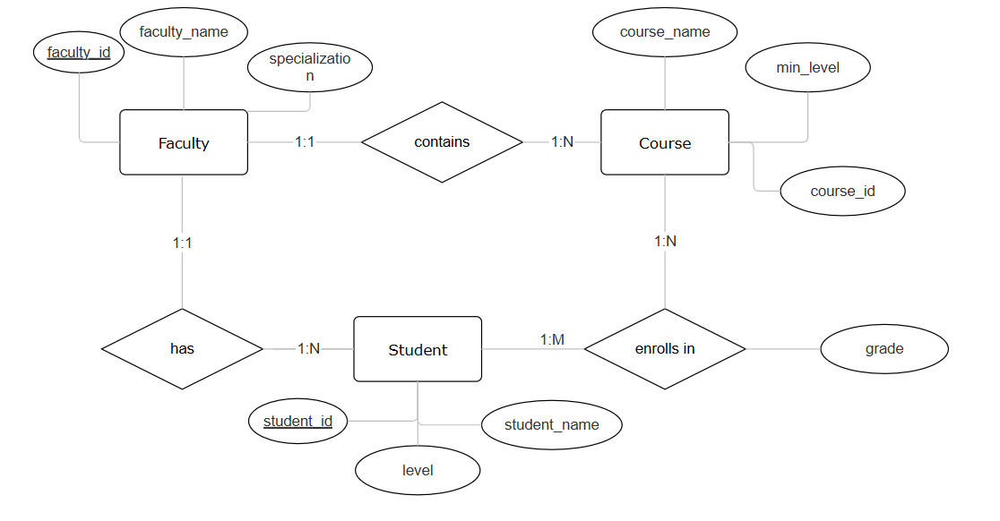
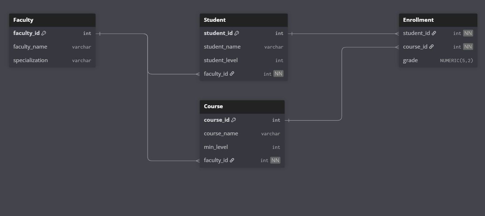

# Part 1: University Database creation
The university system is designed to manage and track the academic performance of students across various faculties and levels. 
## System Structure
### Faculties:
- The university is divided into different faculties.
- Each faculty specializes in a particular field of study and offers specific courses.
### Students:
- Students are enrolled in different faculties based on their chosen field of study.
- Within each faculty, students are further categorized into different levels.
### Courses (Materials):
- Each academic level within a faculty has a set of courses that students must complete.
- Courses are the subjects or units of study that students are required to attend, learn, and be evaluated on.
### Grades:
- The system allows for the recording and management of student grades for each course.
- Each student receives a grade for each course they are enrolled in.

## Requirements:
- Create DDL of the above objects, related relations, and required constrains.
- CRUD operations on students table.
- Add a validation on the database, when added or updated grade less than 0 then prevent insert/update.

### Solution Entity relation diagram

### Solution Relational diagram

### Solution PostgreSQL script
[Open university_db.sql](university_db.sql)
